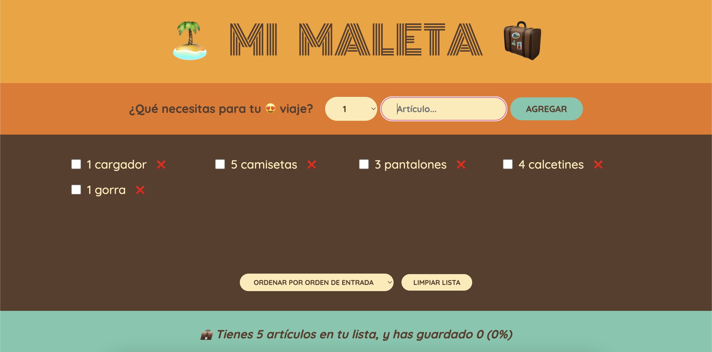
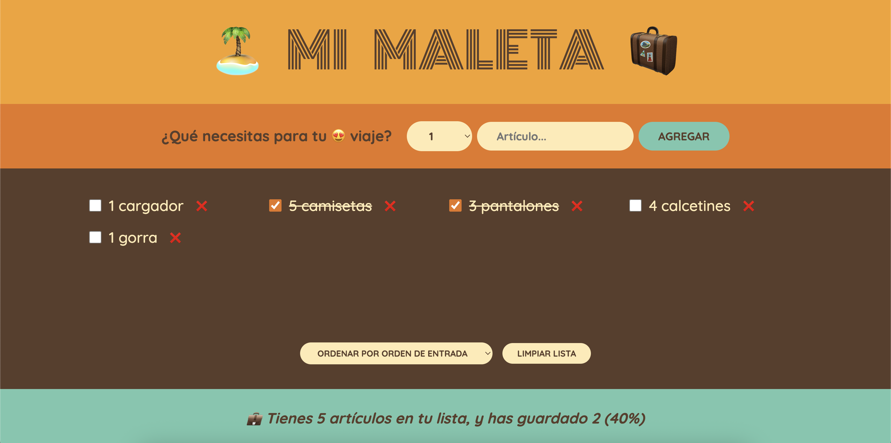

# 🧳 Mi Maleta

**Mi Maleta** es una aplicación web interactiva que te ayuda a preparar y organizar tu equipaje antes de un viaje. Puedes añadir artículos, marcar los que ya empacaste, ordenar la lista y eliminar elementos con facilidad. ¡Ideal para evitar olvidos!

[Mi maleta](https://albahdezs.github.io/mi-maleta/)

## 🚀 Características

- ✅ Añadir artículos a empacar con cantidad.
- ✅ Marcar artículos como empacados.
- ✅ Eliminar artículos individuales o vaciar toda la lista.
- ✅ Ordenar la lista por orden de entrada, descripción o estado.
- ✅ Interfaz intuitiva y diseño responsivo para móviles.

## 🖼️ Vista previa

**Inicial**


**Listado**


**Empaquetado**


## 🛠️ Tecnologías usadas

- **React** — Librería principal para la interfaz.
- **JavaScript (ES6+)**
- **CSS Grid & Flexbox** — Para el diseño responsivo.
- **Hooks de React (`useState`)**

## 🔧 Instalación

1. Clona el repositorio:

```bash
git clone https://github.com/Albahdezs/mi-maleta.git
cd mi-maleta
```

2. Instala dependencias:

```bash
npm install
```

3. Inicia el servidor de desarrollo:

```bash
npm start
```

4. Compila para producción:

```bash
npm run build
```

## 🧠 Ideas futuras

- Guardar lista en localStorage.
- Compartir lista por enlace.

---

## 📬 Contacto

Created by [@Albahdezs](https://github.com/Albahdezs) – ¡no dudes en contactarme!
